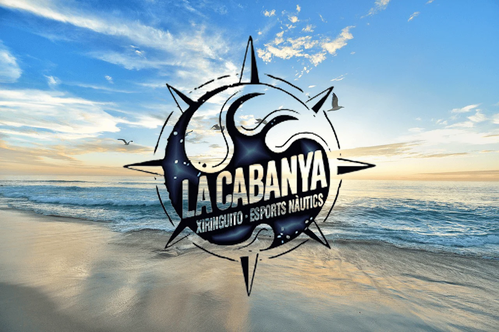

# LaCabanya

## Web turístic de La Cabanya a La Ràpita

## L’accessibilitat web: un dret universal

### Tothom té dret a percebre, entendre, navegar i interactuar
L’accessibilitat és el conjunt de principis i tècniques que s’han de respectar a l’hora de dissenyar, construir, mantenir i actualitzar els webs i les aplicacions per dispositius mòbils per tal que siguin més accessibles als usuaris, especialment a les persones amb discapacitat. L’objectiu és que tothom pugui percebre, entendre, navegar i interactuar amb els webs i aplicacions.