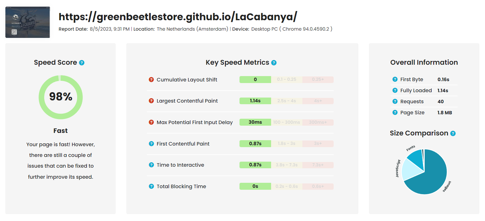

# LaCabanya

## Web turístic de La Cabanya a La Ràpita

Integració Web : [Xavier Torta - © Green Beetle. ](https://greenbeetlestore.github.io/CV/). 

[f.xaviertorta@gmail.com](mailto:"f.xaviertorta@gmail.com). 

Tels. :

· Catalunya : +34 699 27 31 31. 

· França : +33 685 03 21 45.

---

És un Disseny amb llicència [HTML5 UP](https://html5up.net/license).

---

Tot el contingut de codi HTML ha estat validat, sense cap error, per [W3C](https://validator.w3.org/#validate_by_uri).

---

La tecnologia utilitzada per al desenvolupament de la web és html, css, sass i javascipt.

---

Aquesta WEB ha estat creada integrant els màxims estàndards possibles pel que fa a l'<b>Experiència d'Usuari (UX)</b>, tenint en compte els valors de <b>RENDIMENT, ACCESSIBILITAT, PRÀCTIQUES RECOMANADES</b> i <b>SEO</b>, com mostren els resultats en els següents i diferents tests :

### Test amb
[PageSpeed Insights a web.dev](https://pagespeed.web.dev/analysis/https-greenbeetlestore-github-io-LaCabanya/cwir1yh4k9?form_factor=desktop)

### Resultats del test PC
· Ràtio de mitjana 99,5%

### Resultats del test Móbil
· Ràtio de mitjana 92%

### Quant a l'API de PageSpeed Insights

L'API de PageSpeed Insights (PSI) informa sobre el rendiment de les pàgines tant en dispositius mòbils com en ordinadors i ofereix suggeriments per millorar-los.

PSI facilita dades dels experiments i dades de camp sobre les pàgines. Les dades d'experiments són útils per depurar problemes de rendiment, ja que es recullen en un entorn controlat, però és possible que no es detectin problemes de capacitat produïts per volums reals de trànsit. Pel que fa a les dades de camp, són útils per saber què passa amb les experiències d'usuari autèntiques i reals.

### Test amb
[GTmetrix](https://gtmetrix.com/reports/greenbeetlestore.github.io/G4s7MxLK/)

### Resultats del test GTmetrix Grade
· Qualificació "A" 

### Test amb
[GiftOfSpeed](https://www.giftofspeed.com/report/greenbeetlestore.github.io/VqhczJ/)

### Resultats del test GiftOfSpeed Speed Score
· Puntuació de Velocitat 98%

### Test amb
[WAVE](https://wave.webaim.org/report#/https://greenbeetlestore.github.io/LaCabanya/)

### Resultats del test WAVE web accessibility evaluation tool
· Puntuació d'accessibilitat 100%

---

## 1.Rendiment

La construcció de llocs web requereix HTML, CSS i JavaScript. Per crear llocs web i aplicacions que la gent vulgui fer servir, que atreguin i retinguin els usuaris, heu de crear una bona experiència d'usuari. Part de la bona experiència de l'usuari és garantir que el contingut es carregui ràpidament i respongui a la interacció de l'usuari. Això es coneix com a rendiment web, i en aquest mòdul aprendrà tot el que necessiteu per crear llocs web de rendiment.

El rendiment web és el mesurament objectiu i l'experiència percebuda per l'usuari del temps de càrrega i el temps d'execució. El rendiment web és el temps que triga un lloc a carregar-se, a ser interactiu i receptiu, i al grau de fluïdesa del contingut durant les interaccions de l'usuari. És el desplaçament suau? Es pot fer clic als botons? Les finestres emergents s'obren ràpidament i s'animen sense problemes en fer-ho? El rendiment web inclou mesures objectives com el temps de càrrega, quadres per segon i temps per a experiències interactives i subjectives de quant de temps va trigar a carregar-se el contingut.

Moltes característiques afecten el rendiment, inclosa la latència, la mida de l'aplicació, la quantitat de nodes DOM, la quantitat de sol·licituds de recursos realitzades, el rendiment de JavaScript, la càrrega de la CPU i més. És important minimitzar els temps de càrrega i resposta, i afegir funcions addicionals per ocultar la latència en fer que l'experiència sigui el més accessible i interactiva possible, tan aviat com sigui possible, mentre es carrega de forma asíncrona a les parts més llargues de l'experiència.

Hi ha eines, API i millors pràctiques que ens ajuden a mesurar i millorar el rendiment web.

### Puntuació de rendiment

Al principi de l'informe que es genera al PSI, es mostra una puntuació que resumeix el rendiment d'una pàgina. Aquesta puntuació es determina quan executeu l'eina Lighthouse, que recull i analitza les dades d'experiments sobre cada pàgina. Si aquesta puntuació és igual o superior a 90, es considera que la velocitat de la pàgina és ràpida; si està entre el 50 i el 90, es considera normal, i si és inferior a 50 es considera lenta.

---

## 2.Accessibilitat

Accessibilitat Web significa que llocs web, eines i tecnologies estan dissenyades i desenvolupades de manera que les persones amb discapacitats poden usar-les. Més concretament, les persones poden: 

· percebre, comprendre, navegar i interactuar amb la web.

· contribuir a la Web

L'Accessibilitat web inclou totes les discapacitats que afecten l'accés a la Web, incloent-hi:

· auditives

· cognitives

· neurològiques

· físiques

· de la parla

· visuals

L'accessibilitat web també beneficia persones sense discapacitat, com ara:

· persones utilitzant telèfons mòbils, rellotges intel·ligents, televisors intel·ligents i altres dispositius amb pantalles petites, diferents modes d'entrada, etc.

· persones grans les habilitats de les quals canvien amb l'edat.

· persones amb “discapacitats temporals”, com ara un braç trencat o la pèrdua d'unes ulleres.

· persones amb “limitacions per la seva ubicació”, com pot ser sota la llum del sol o en un entorn on no es pot escoltar àudio.

· persones amb connexió lenta a Internet o que tenen ample de banda limitat o costós

Per a moltes persones, la tecnologia facilita les coses. Per a les persones amb alguna mena de discapacitat, la tecnologia fa les coses possibles. Accessibilitat significa desenvolupar contingut perquè sigui tan accessible com sigui possible sense importar les habilitats físiques i cognitives d'un individu i sense importar com accedeixi a la web.

"El Web està dissenyat fonamentalment perquè funcioni per a totes les persones, independentment del maquinari, programari, idioma, cultura, ubicació, capacitat física o mental. Quan el Web compleix aquest objectiu, és accessible per a persones amb una àmplia gamma de capacitats auditives , de moviment, de vista i cognitives." [W3C - Accessibilitat](https://www.w3.org/mission/accessibility/)

## L’accessibilitat web: un dret universal

### Tothom té dret a percebre, entendre, navegar i interactuar

L’accessibilitat és el conjunt de principis i tècniques que s’han de respectar a l’hora de dissenyar, construir, mantenir i actualitzar els webs i les aplicacions per dispositius mòbils per tal que siguin més accessibles als usuaris, especialment a les persones amb discapacitat. L’objectiu és que tothom pugui percebre, entendre, navegar i interactuar amb els webs i aplicacions.

Les pautes d'accessibilitat al contingut web (Web Content Accessibility Guidelines - WCAG) són uns documents que expliquen com fer el contingut web accessible per a persones amb discapacitat. Podeu informar-vos directament a [WCAG](https://wcag.com/).Las Pautas de Accesibilidad para el Contenido Web (WCAG) se desarrollan a través del proceso del [W3C](https://www.w3.org/TR/WCAG21/) (en Inglés) en cooperación con personas y organizaciones de todo el mundo, con el fin de ofrecer un estándar único y compartido que satisfaga las necesidades de las personas, organizaciones y gobiernos a nivel internacional.

Introducción a las [WCAG · Pautas de Accesibilidad para el Contenido Web](https://www.w3.org/WAI/standards-guidelines/wcag/es#intro) (en Espanyol).

Cada dia hi ha milers i milers de persones que tenen dificultats per obtenir informació d’un web o d’una aplicació mòbil, ja que moltes d’aquestes no estan adaptades per a persones amb problemes físics, ja siguin audiovisuals, auditius, d’ansietat o discapacitats físiques o motores. Per tal d’abordar aquest problema, el 2016 es va crear una <a href="https://www.boe.es/diario_boe/txt.php?id=BOE-A-2018-12699">nova normativa</a> en matèria d’accessibilitat que obliga als organismes del sector públic que els seus els webs i aplicacions per a dispositius mòbils compleixin els <a href="http://accesibilidadweb.dlsi.ua.es/?menu=criterios-2.0">criteris d’accessibilitat</a>.

Segons aquesta normativa, a partir del 20 de setembre de 2020 tots els webs (informacionals i d’aplicacions web) dels organismes públics hauran d’haver aplicat aquests criteris d’accessibilitat. A partir del 23 de juny de 2021 l’obligació també serà per les aplicacions mòbils. Per altra banda, i segons la normativa, els webs publicats a partir del 20 de setembre de 2018 han tingut un any per adaptar-se als criteris.

Tot i que només els organismes del sector públic estan obligats a complir la normativa, tots i totes nosaltres podem fer petits gestos per facilitar la vida a aquelles persones que ho necessiten. I és que tots i totes hauríem de garantir que una pàgina web pugui ser utilitzada per qualsevol persona, independentment de si té o no les capacitats personals o sensorials o els coneixements tècnics adequats. Amb petits gestos com els esmentats en aquest post, millorarem la qualitat de vida i l’autonomia de totes aquestes persones i, com a conseqüència, millorarem el nostre <b>posicionament web (SEO)</b>.

Aquest accés ha de ser universal, per tots els usuaris, independentment dels seus recursos tecnològics (tipus de dispositius, resolucions de pantalla…), la seva formació, cultura i capacitat d’aprenentatge i les seves condicions físiques (problemes visuals, auditius, d’ansietat, discapacitats físiques o motores…).

---

## 3.Pràctiques Recomanades

Millorar el rendiment del vostre lloc és una part important en el procés de creació, així com del manteniment continu. Les pautes de pràctiques recomanades permeten millorar l'experiència d'usuari i, per tant, altres aspectes, com la capacitat de resposta, la fluïdesa i el temps de càrrega.

Temps de càrrega del lloc, utilitzar correctament la memòria cau

Ordre de càrrega dels elements, prioritzant la construcció del DOM

Optimització dels elements en mida, resolució, format, etc.

Optimització de la web per a mòbil, que sigui responsiva per a diferents aparells.

Codi de tercers, que sigui de confiança, net, segur i lleuger.

---

## 4.SEO "Search Engine Optimisation"

Recorda el significat de les sigles SEO, “optimització per a motors de cerca”, i què són els motors de cerca?, eines de consulta constituïdes per algorismes. Els algorismes es comuniquen amb codis i és allà on l'HTML compleix la seva funció, per donar a entendre al cercador que tens una web perfecta, sense defectes de navegació i llista per complaure totes les consultes de la teva audiència, per tant, t'espera un posicionament web genial a la pàgina de resultats.

Per saber-ne més sobre el SEO podeu llegir l'article de [Seo Power Tools](https://www.seo.es/que-es/seo).

Exemple
[Visita la web](https://greenbeetlestore.github.io/LaCabanya/)
